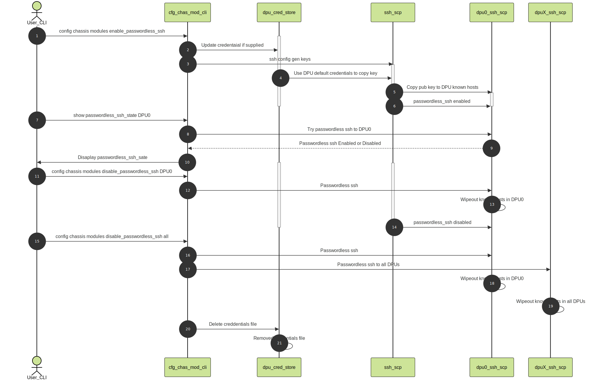

#  Smart Switch DPU Password Less SSH High Level Design

## Table of Contents ##

- [Smart Switch DPU Password Less SSH Design](#smart-switch-dpu-password-less-ssh-design)
  - [Table of Contents](#table-of-contents)
  - [Revision](#revision)
  - [Glossary](#glossary)
  - [Overview](#problem-definition)
  - [Solution](#solution)
  - [Assumptions](#assumptions)
  - [Requirements](#requirements)
  - [References](#references)

## Revision ##

| Rev | Date       | Author           | Change Description |
| --- | ---------- | ---------------- | ------------------ |
| 0.1 | 02/17/2025 | Ramesh Raghupathy | Initial version    |

## Glossory ##
 authenticai
| Term  | Meaning                                   |
| ----- | ----------------------------------------- |
| DPU   | Data Processing Unit                      |
| NPU   | Network Processing Unit                   |
| EDVT  | Electrical Design Verification Testing    |
| SSH   | Secure Shell                              |

## Problem Definition ##

There are uses cases such as utility scripts, sonic-management tests, EDVT, manufacturing workflows need to ssh to the DPUs from the NPU. Accessing the DPUs using the  username/password-based approach, either interactively or programmatically, has its own downside of remembering the password, interactively entering every time or hard coding the credentials. This not only leads to several complications but also has its own security implications even in open software or open PID environments.

## Solution ##

After considering the following three options, SSH key-based authentication seems to be a more suitable option for this purpose.

1. Configure the DPU with the default user account having  "NOPASSWD" privileges in the /etc/sudoers file. The downside to this approach is that, disabling passwords completely leaves the system highly vulnerable to unauthorized access.

2. SSH key-based authentication: Set up SSH key pairs to allow logins without a password using public key cryptography. Share the host (NPU) ssh public keys with the DPUs.

3. Using a third party authentication server. This is slightly heavy weight for this purpose.

## Assumption ##

Any user having access to the NPU will be able to access the DPUs in a SmartSwitch irrespective of their privileges during the window where password less ssh is enabled.

## Requirement ##

A user on NPU should be able to ssh to any DPU interactively or programmatically without a password. 

## Workflow ##

On host:
1.	Generate the SSH key  (Preferably with passphrase)
2.	Secure files
* Private key - 600
* Public key - 644
3.	Copy public key to DPUs
* For this we need to access the DPU first time using the default credentials
* Don’t hard code the default credentials, provide them from a file in the platform directory ( This makes it flexible for every vendor )
* Also, this enables the script to be independent of the default credentials
* Encrypt the default credentials
* All the above will be accomplished with a script and will be activated from the “config chassis modules enable_passwordless_ssh” CLI.  More details can be found in the following sections.
4.	Connect to DPUs using ssh without password
* ssh admin@169.254.200.1  (no password needed)

## Trigger using CLI on NPU ##
The sequence flow diagram clearly shown the behavior
* Extend the “config chassis modules …” CLI and “show chassis modules …” CLIs to solve this purpose
* New CLI on NPU:
  ```
  config chassis modules enable_passwordless_ssh  --username <optional> --password <optional>
  ```
* When the credentials are not provided through the CLI the credential file on the NPU “/usr/share/sonic/device/<platform>/dpupassword” will be used.  If this file doesn’t exist then the passwordless_ssh will not be enabled

* When the credentials are provided there will be two options either to overwrite the existing file or the append to the existing file.  Then this file will be used for copying the keys the first time

* config chassis modules disable_passwordless_ssh  DPUx  is another CLI used the disable the password. This CLI will wipeout the known hosts file on the specified DPUx

* config chassis modules disable_passwordless_ssh  all .  This will wipeout the known hosts file on all DPUs and also remove the credential file.

* show chassis modules passwordless_dpu_state is a show CLI which will show the passwordless_ssh_state of all the DPUs

## Flow Diagram ##

<p align="center"></p>

## Sequence of operation ##

1.	Use “config chassis modules startup <module-or-all-option>” to power on DPU modules

2.	When password less ssh is needed, enable it using the CLI “config chassis modules enable_passwordless_ssh DPUx … <optional-credentials>”

    ```
    Example:1
    root@MtFuji:/home/cisco# config chassis modules enable_passwordless_ssh DPU0
    Enabling dpu_passwordless_ssh for DPU0
    SSH key successfully copied to 169.254.200.1 using admin

    Example:2
    root@MtFuji:/home/cisco# config chassis modules enable_passwordless_ssh -h
    Usage: config chassis modules enable_passwordless_ssh [OPTIONS] <module_name>

    Enable password less SSH for DPUs

    Options:
      --username TEXT  The username for authentication
      --password TEXT  The password for authentication
      -?, -h, --help   Show this message and exit.

    ```
3.	Provide the credentials through the CLI or create the DPU default credentials file as shown.
    ```
    Example:
    File: /usr/share/sonic/device/<platform>/dpupassword
    admin1
    encrypted-password1

    admin2
    encrypted-password2
    ```
4.	Access the enabled DPU without a password
    ```
    Example: ssh admin@169.254.200.1 -y
    ```
5.	Use the “show chassis modules passwordless_ssh_state”
    ```
      DPU             IP    	Passwordless SSH    	Operational Status
    -----  	-------------  	----------------------- 	--------------------
    DPU0  169.254.200.1             Enabled                Online
    DPU1  169.254.200.2             Enabled                Online
    DPU2  169.254.200.3             Enabled                Online
    DPU3  169.254.200.4            Disabled                Online
    DPU4  169.254.200.5            Disabled               Offline
    DPU5  169.254.200.6            Disabled               Offline
    DPU6  169.254.200.7            Disabled               Offline
    DPU7  169.254.200.8            Disabled               Offline
    ```
6.	Use “config chassis modules enable_passwordless_ssh all” if you would like to enable passwordless ssh to all DPUs

7.	To disable passwordless ssh, use “config chassis modules disable_passwordless_ssh DPU0” CLI to disable password less ssh to DPU0.
    ```
    Example:
    root@MtFuji:/home/cisco# config chassis modules disable_passwordless_ssh DPU0
    Disabling passwordless SSH for DPU0
    Passwordless SSH disabled for DPU0

    root@MtFuji:/home/cisco# show chassis modules passwordless-ssh-state
      DPU             IP    	Passwordless SSH    	Operational Status
    -----  	-------------  	------------------  		--------------------
    DPU0  169.254.200.1            Disabled                Online
    DPU1  169.254.200.2             Enabled                Online
    DPU2  169.254.200.3             Enabled                Online
    DPU3  169.254.200.4            Disabled                Online
    DPU4  169.254.200.5            Disabled               Offline
    DPU5  169.254.200.6            Disabled               Offline
    DPU6  169.254.200.7            Disabled               Offline
    DPU7  169.254.200.8            Disabled               Offline
    ```
8.	To disable passwordless ssh to all DPUs and remove the default credential file, use “config chassis modules disable_passwordless_ssh all”

9.	When the “config chassis modules shutdown <module-or-all-option>” cli is issues the password less ssh option is automatically disabled.

10.	Note: The “enable” cli must be issued after powering on a DPU or once after powering on all DPUs.


