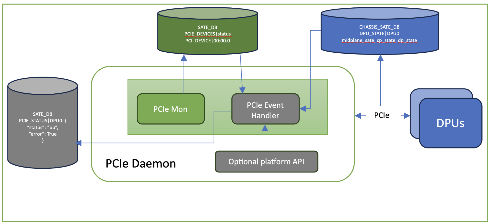

# SmartSwitch PCIe Event Handler High Level Design

| Rev | Date | Author | Change Description |
| --- | ---- | ------ | ------------------ |
| 0.1 | 09/11/2024 | Ramesh Raghupathy | Initial version|


## Definitions / Abbreviations

| Term | Meaning |
| --- | ---- |
| PCIed | PCIe Daemon |

## 1. About This Manual
Though this document is referred as SmartSwitch PCIe Event handler, it is a generic PCIe event handler and an extension of the existing SONiC PCIe Monitoring Services.  This document will focus on the SmartSwitch/DPU specific use cases.  This PCIe event handler will combine the available PCIe state data from three sources and produce a precise PCIe state output for the selected devices and present it in a simple and easily consumable format for the clients. This can be further extended to alert the clients of all event changes for the specified devices.

## 2. Design
### SmartSwitch PCIe Event Handler Block Diagram
<p align="center"></p>
### First source of PCIe mid-plane state:  SmartSwitch DPU_STATE table

In the existing SmartSwitch design the DPU_STATE information provides the DPU mid-plane, DPU control-plane, DPU data-plane states. If the DPU mid-plane is healthy these states are accurate.  However, when the DPU mid-plane goes down the DPU will not be able to update the mid-plane state, and the last update state may not be accurate.

### Second source of PCIe mid-plane state: PCIE_DEVICES|status and PCIE_DEVICE|id

SONiC has a PCIe monitor and pcie-check.service as part of the PMON PCIed.  The HLD for this implementation can be found at doc/pcie-mon/pcie-monitoring-services-hld.md.  This basically uses the pcie.yaml file for the devices to monitor and updates the status and error information into the STATE_DB tables every 60 secs.  The format of the status and error provided by this can’t be readily consumed by the clients.  This will be extended to reformat the data as show here.

```
Input: Subset of PCIe devices requiring new table update

Output:   # One per the subset of PCIe devices

status:  up/down  # string output ‘UP’ or ‘DOWN’

error: True/False # Boolean to indicate any error
```

### Optional third source of PCIe mid-plane state: Platform API to provide any additional PCIe mid-plane state

This is an optional API and platforms that have other ways to get the mid-plane state can use this to report the state.  This API will return a “bool” to indicate the state of the given module. This will be defaulted to ‘True’ and when platforms don’t support this the default state will be ANDed with the first and second source to produce the resultant output.

API: 
```
get_pcie_state(self, module)
Returns: True/False Defaulted to True when platforms don’t implement this
```


## 3. SmartSwitch PCIe Event Handler
This is just an extension of the PCIed and the status from the sources mentioned above are ANDed and updated in a new table ins STATE_DB for clients to consume easily. The schema is shown below.
The PCIe mid-plane error status will be updated into this table from the PCIed.
```
Schema:
DB: STATE_DB
KEY:  PCIE_STATUS|DPU0
“PCIE_STATUS|DPU0”: {
    “status”:  “up”,
     “error”: True
}
```
In the initial implementation the clients are required to look for the change in the status for state transitions and act on it.  In future this logic can be enhanced to provide state change notifications to clients including the changes in error state.

Frequency of data update: The current limitation is the PCIed update interval of 1 min but can be even less as there are two other sources updating.

PCIe Errors: The error field is nothing but an aggregation of the AERs provided in “PCIE_DEVICE|00:00:0” This can be further extended to combine the Linux PCie error events

